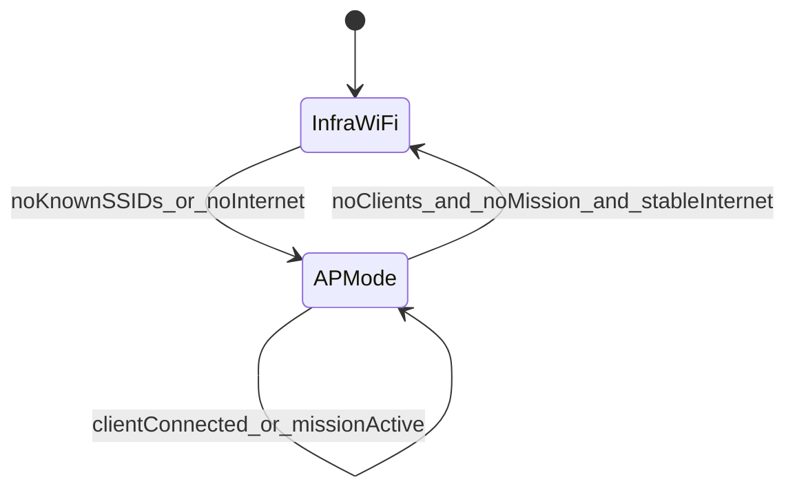

# Offline-First Drone Control (Presidio)

## Goals
- iOS app is the strategic brain (local LLM + optional vision).
- Orin Nano is the tactical executor (ROS2 + MAVROS).
- No cloud dependency required for local missions.
- Deterministic, debuggable, safe behavior.

## File structure
- `drone/common/network_manager.py` (Orin Wi-Fi state machine)
- `drone/common/network_manager.yaml.example` (config)
- `drone/common/local_control_api.py` (local HTTPS API)
- `drone/common/mission_runner.py` (mission state + ROS2/MAVROS stub)
- `drone/platforms/orin/astral-network-manager.service` (systemd unit)
- `drone/platforms/orin/astral-local-control.service` (systemd unit)
- `client/ios/DroneOperator/DroneOperator/Models/Mission.swift` (schema)
- `client/ios/DroneOperator/DroneOperator/Services/LocalDroneControlClient.swift`
- `client/ios/DroneOperator/DroneOperator/Services/LocalLLMService.swift`
- `client/ios/DroneOperator/DroneOperator/Services/VisionService.swift`

## Orin networking state machine
Two states only:
- **Infrastructure Wi‑Fi with internet**
- **AP mode fallback**

Rules:
- On boot: connect to any known SSID. If internet check fails, switch to AP.
- If no known SSIDs: start AP.
- AP is never stopped if a client is connected or a mission is active.
- Switch back only after internet is stable for N seconds and no clients/mission.

Mermaid:


Config lives in `/etc/presidio/network_manager.yaml` (see example file).

AP defaults:
- SSID: `Presidio-<model>-<last4>`
- WPA2/WPA3 enabled
- IP: `192.168.4.1`
- DHCP: `192.168.4.10-192.168.4.100`

## Local control API (Orin)
Transport: HTTPS (self‑signed cert generated on first run).

Auth:
- Pairing token stored at `/var/lib/astral/pairing_token.json`.
- Client sends `Authorization: Bearer <token>`.

Endpoints:
- `POST /mission` (strict JSON schema)
- `GET /status`
- `POST /abort`

Mission schema:
```json
{
  "goal": "...",
  "target": {...},
  "constraints": {...},
  "failsafes": {...}
}
```

Mission execution is routed through `mission_runner.py`, which toggles
`/var/lib/astral/mission_active.json` to keep AP alive during flight.

## iOS app behavior
- Joins the drone AP via `NEHotspotConfigurationManager` (join once, remember).
- Reconnects automatically using the configured SSID.
- Sends structured mission JSON only via the local control API.
- Uses Keychain to store the pairing token.

## Core ML LLM integration steps
1. Quantize LLaMA‑3.1‑8B‑Instruct to INT4/INT8 for mobile.
2. Convert to Core ML (`.mlmodelc`).
3. Bundle the model in the iOS app.
4. Load via `LocalLLMService.loadModel(named:)`.
5. Parse output strictly with `LocalLLMService.parseMissionJSON(_:)`.

## Optional vision
`VisionService` is a placeholder that should feed only labels, bounding boxes,
and attributes into the LLM prompt. Vision does not plan missions.
